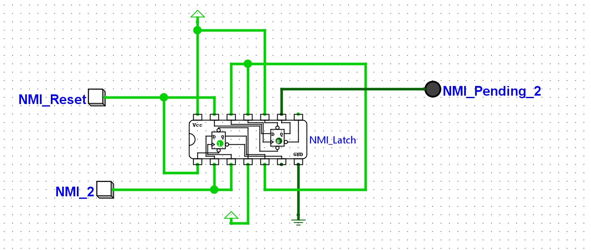
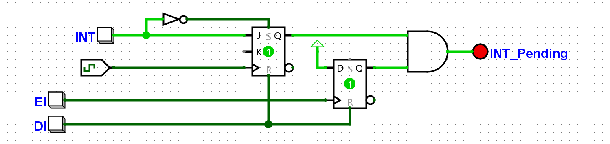

# Experiments with Interrupts

One area that has been bugging me in this design has been the lack of interrupts. I was so absorbed in trying to structure the control logic that I missed a crucial mechanism - interrupt logic is normally checked at the end of the current instruction.

Keeping this in mind, I realized in my design, I simply needed to have an additonal "T" State to do a check for an interrupt, and if present start an "I" state counter to clock through the logic needed to do what an intrupt handler needs in place before the first instruction of the Interupt subroutine is executed.

I want to implement something similar to what most CPU designs have, an NMI (Non-maskable interrupt), a maskable INT (controlled via the EI and DI instructions). And even a vectored interupt using an offset register. Once the basic logic was in pllace, I could add to it later.

The first thing to do was work out how to latch the signals for the different types of interupts. Logisim Evolution seamed like the tool to use.

## NMI Pending logic using Logisim Evolution

This circuit captures the NMI and generates a latched signal. The RETI instruction can be used to reset the latch, this avoids retriggers.

## Using a TTL 74LS74 Chip

As I've done before, I decided to see if I could implement it in TTL, this circuit under went a few design changes as the signal to some of the pins showed errors in the circuit that did not appear using the basic "D" Flip-Flops.

## Implementing EI / DI logic 

The logic for the EI and DI turned out to be surprisingly easy, pulsing the CLK (clock) & CLR (Reset) pins of the 74LS74 to set and clear a latch that has the "Q" output AND'd to the INT latch results in masking or enabling the INT signal to propagate through.

More to come.......
